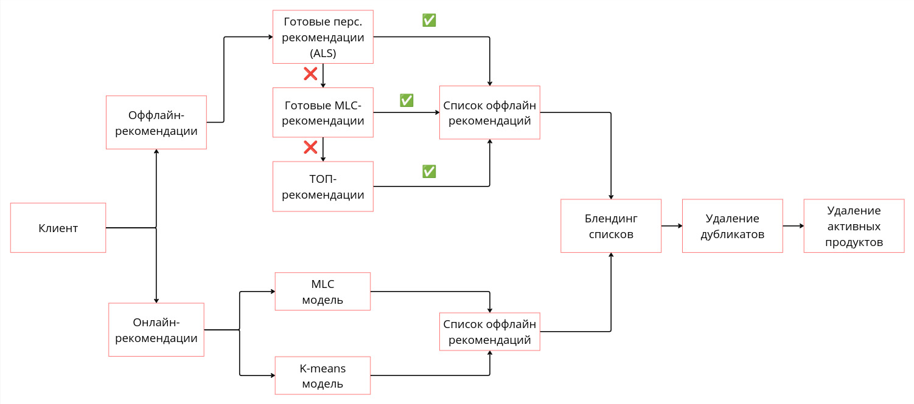
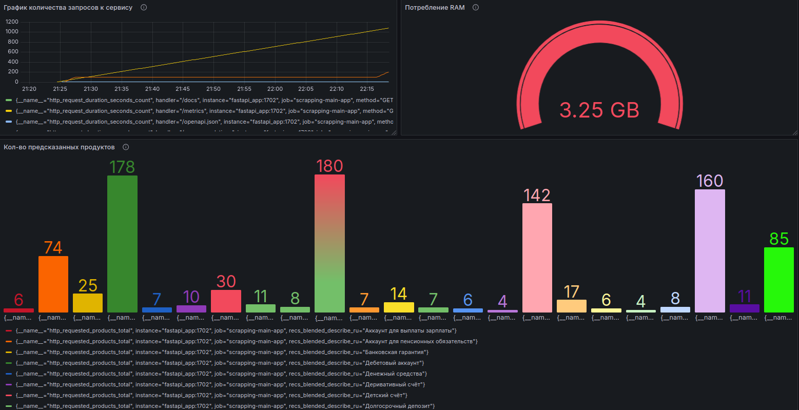

# Выпускной проект
## Выбран Кейс 1: Рекомендации банковских продуктов

## Понимание задачи бизнеса
Современные банки постепенно становятся глобальными экосистемами. Однако мы обратимся к традиционной задаче — предсказать, какие банковские продукты (кредиты, депозиты, инвестиционные продукты) подойдут тем или иным клиентам.
Для банков крайне важно продавать клиентам «правильные продукты». Внедрение рекомендательных систем для предоставления персонализированных рекомендаций реальным и потенциальным клиентам может существенно повлиять на продажи продуктов, увеличивающих оборот и доход.

## Трансляция задачи бизнеса в техническую задачу
Рекомендательные системы помогают предоставить пользователям наиболее релевантные их интересам объекты: товары, развлекательный контент, образовательный материал, профили других пользователей и т. п. Эти пользовательские предпочтения обычно выводятся с помощью оценок элементов. 
В нашей задаче рекомендации банковских продуктов клиенту мы сталкиваемся с несколькими проблемами:
 - отсутствие явных оценок продуктов клиентами для целей рекомендации;
 - проблема холодного старта, затрудняющая рекомендовать продукты потенциальному
или новому клиенту из-за отсутствия информации о предпочтениях и оценках клиента;
 - достаточно ли алгоритму будет сравнения по 20-30 продуктам (будет ли эффективен в таких условиях ALS-алгоритм).

## Цель
Предсказать, какой банковский продукт предложить клиенту.

Будет реализован гибридный подход, который сочетает в себе решение задачи ранжирования (ALS-алгоритм), задачи кластеризации (K-means), а также решение задачи мультилейбл-классификации (Multi-label classification).

### Исходные данные
Первичные данные находятся в одном файле `train_ver2.csv`.

Описание данных:
```
fecha_dato	Колонка для разделения таблицы
ncodpers	Идентификатор пользователя
ind_empleado	Статус занятости:
- A — трудоустроен
- B — безработный, раньше работал
- F — иждивенец
- N — безработный
- P — пассивный (статус не определён)
pais_residencia	Страна резидентства
sexo	Пол
age	Возраст
fecha_alta	Дата, когда клиент впервые заключил договор в банке
ind_nuevo	1, если клиент зарегистрировался за последние 6 месяцев
antiguedad	Стаж клиента (в месяцах)
indrel	1 — первичный клиент
99 — первичный клиент в течении месяца, но не в конце
ult_fec_cli_1t	Последняя дата, когда клиент был премиальным
indrel_1mes	Тип клиента в начале месяца:
- 1 — премиальный
- 2 — собственник
- P — потенциальный
- 3 — раньше был премиальным
- 4 — раньше был собственником
tiprel_1mes	Тип клиента в начале месяца:
- A — активный
- I — неактивный
- P — бывший
- R — потенциальный
indresi	Если страна проживания совпадает со страной банка
indext	Если страна рождения клиента отличается от страны банка
conyuemp	1, если клиент супруг(а) работника
canal_entrada	Канал, по которому пришел пользователь
indfall	Индекс актуальности счёта (англ. Deceased index, N/S)
tipodom	Тип адреса (1 — основной адрес)
cod_prov	Код провинции (адреса клиента)
nomprov	Имя провинции
ind_actividad_cliente	Активность пользователя (1 — активный, 0 — неактивный)
renta	Доход домохозяйства
segmento	Сегментация: 1 — VIP, 2 — Обыкновенные 3 — выпускники колледжей
ind_ahor_fin_ult1	Сберегательный счёт
ind_aval_fin_ult1	Банковская гарантия
ind_cco_fin_ult1	Текущие счета
ind_cder_fin_ult1	Деривативный счёт
ind_cno_fin_ult1	Зарплатный проект
ind_ctju_fin_ult1	Детский счёт
ind_ctma_fin_ult1	Особый счёт 3
ind_ctop_fin_ult1	Особый счёт
ind_ctpp_fin_ult1	Особый счёт 2
ind_deco_fin_ult1	Краткосрочный депозит
ind_deme_fin_ult1	Среднесрочный депозит
ind_dela_fin_ult1	Долгосрочный депозит
ind_ecue_fin_ult1	Цифровой счёт
ind_fond_fin_ult1	Денежный средства
ind_hip_fin_ult1	Ипотека
ind_plan_fin_ult1	Пенсионный план
ind_pres_fin_ult1	Кредит
ind_reca_fin_ult1	Налоговый счёт
ind_tjcr_fin_ult1	Кредитная карта
ind_valo_fin_ult1	Ценные бумаги
ind_viv_fin_ult1	Домашний счёт
ind_nomina_ult1	Аккаунт для выплаты зарплаты
ind_nom_pens_ult1	Аккаунт для пенсионных обязательств
ind_recibo_ult1	Дебетовый аккаунт
```

## Основные задачи 
 - Анализ данных о клиентах 
 - Определение важных метрик
 - Моделирование
 - Продуктивизация модели
 - Настройка мониторинга

## Необходимая инфраструктура
`MLFlow/S3/Docker/FastApi/Prometheus/Grafana`

## Необходимые зависимости
`requirements.txt`

## Переменные
`.env`

## Шаги и результаты

```
1. Исследование данных. 

Проведен первичный анализ данных в Jupyter Notebook и описаны увиденные в них закономерности.	

  - Jupyter Notebook с EDA: recommendations_EDA.ipynb. 
  - Папка с графиками: assets.
  - Папка с данными: data.
  - Результаты описаны в конце ноутбука, а также после каждого исследования признаков в ячейках.
  - Таблицы загружены в хранилище S3, а артефакты в MLflow.

Этапы работ в ноутбуке включают в себя:

    I. Исследование и анализ данных о клиентах (загрузка первичных данных, описание, обзор, проверка проблем в персональных данных клиентов и в данных о продуктах, исправление проблем).

    По итогу анализа были сделаны следующие выводы (более подробная информация есть в ноутбуке):
    Портрет пользователя банка:
    - Безработный испанец(ка), живущий в Испании (большая вероятность, что из Мадрида). 
    - Возраст 25 лет (Выпускник колледжа, маленький стаж) и 50 лет (Обыкновенный, большой стаж). 
    - Доход 70,000.
    - Пользуются продуктами банка больше 6 месяцев.
    - Половина из них Активно пользуются банком, половина - неактивно.
    По популярности банковских продуктов:
    - Самым массовым банковским продуктом является "Текущие счета". Его оформляли 7975656 раз, что составляет 68% из числа всех взаимодействий. 
    - Также 67% пользователей хотя бы раз пользовались этим продуктом.
    - Возраст пользователя, который пользуется этим продуктом: небольшой перевес в сторону молодого поколения (61%). 
    - По полу и активности - одинаково.

    II. EDA. Построены графики:

     - по динамике пользователей и событий по месяцам (data/1_events_by_months.png); 
     - популярности продуктов (data/2_features_by_products.png);  
     - распределение клиентов по возрасту и полу (data/3_age_vs_sexo.png); 
     - распределение клиентов по активности и полу (data/4_age_vs_actividad.png); 
     - распределение по длительности пользования банковскими продуктами (data/5_duration_of_use.png).

    III. Сохранение данных:

     - очищенный датасет и остальные таблицы сохранены в формате parquet в папке data/ (на локале).
     - все таблицы загружены в S3 в папку final_project/data/.
     - артефакты (ноутбук и графики, а также некотореы таблицы) залогированы в MLflow в 
        EXPERIMENT_NAME = "marselkamilov_final_project"
        RUN_NAME = "EDA"
        🏃 View run EDA at: http://127.0.0.1:5000/#/experiments/78/runs/f119e86eead749a1a24fcb6097cf7ce8
        🧪 View experiment at: http://127.0.0.1:5000/#/experiments/78


2. Подготовка инфраструктуры. 

Развернут MLflow с хранилищем артефактов.	
 - sh-скрипт с запуском и настройкой MLflow: run_mlflow_server.sh.
 - запуск: sh run_mlflow_server.sh.
 - переменные окружения загружаются из .env.


3. Трансляция. 

Для решения нашей задачи был выбран следующий подход и метрики:
Оталкиваясь от исследований в этой области было решено строить алгоритм рекомендательной системы банковских продуктов
на основе гибридного подхода, которая сочетает метод коллаборативной фильтрации (ALS) и демографический подход.
По ALS подходу будем использовать для обучения только продукты клиентов.
Демографический подход предполагает в качестве обучающего набора использование таких данных, как возраст, пол, доход, активность, стаж и место жительства. Будем решать задачу без учителя (k-means кластеризацию) и с учителем (мультилейбл-классификации) с транзакциями по продуктам в качестве таргета.

Этапы построения алгоритма РС:

   I. Построение ALS-алгоритма по транзакциям: 

    - Построение UI-матрицы «клиенты-продукты» для каждого клиента на основе неявной оценки продукта по определенной шкале в зависимости
от частоты использования этого банковского продукта; 
    - Обучение модели с помощью фреймворка implicit;
    - Прогнозирование отсутствующих продуктов для клиента.

   II. Построение алгоритма по демографическому подходу (K-means): 

    - Группировка пользователей в кластеры на основе демографических
данных, такие как (возраст, пол, доход, активность, стаж и место жительства) с применением алгоритма k-средних;
    - Построение матрицы «кластеры-продукты», содержащей средние значение ежемесячных записей о продуктах для каждого кластера;
    - Прогнозирование продуктов для клиента, в зависимости от кластера, в который он попал.

   III. Построение алгоритма по демографическому подходу и транзакциям (мультилейбл-классификации): 

    - Решение задачи мультилейбл-классификации, где в качестве признаков (X) используются демографические
данные (возраст, пол, доход, активность, стаж и место жительства), а в качестве таргета (y) ипользуются ежемесячные записи о продуктах, которые имеет клиент;
    - Обучение catboost модели;
    - Прогнозирование продуктов для клиента в виде сортированного списка вероятностей продуктов (MultiLogloss).

Разбиение данных:

 - В ALS данные разделяются на обучающий и тестовый набор по глобальному разделению по времени (Global Time Split, Temporal Global). Выбирается одна точка во времени ts: все события до неё входят в тренировочную выборку (прошлое), после неё — в тестовую (будущее). На основе обучающего набора формируется UI-матрица «клиенты-продукты». Для формирования тестового набора выбираются клиенты как минимум с тремя продуктами в наборе данных с оценками продуктов.
 - В K-means в целях экономии ресурсов в качестве обучающей выборки первые 2 млн данных, а в качестве теста следущие 0.5 млн. Предварительно признаки кодируются.
 - В MLC также в целях экономии ресурсов в качестве обучающей выборки первые 2 млн данных, а в качестве теста следущие 0.5 млн. Указывается список категориальных фичей при инициализации catboost модели.

Метрики:

 - В ALS для оценки модели выбрана метрика ранжирования NDCG@3. Она принимает значение от 0 (предлагаемый порядок никак не соответствует истинному) до 1 (предлагаемый порядок в точности соответствует истинному). Для каждого клиента сравниваются порядки als-скоров с нормированной частотой использования банковского продукта, затем осредняются.
 - В K-means для оценки модели также выбрана метрика ранжирования NDCG@3. Для каждого кластера сравниваются порядки als-скоров трейна со списком средних значений ежемесячных записей о продуктах каждого кластера теста.
 - В MLC для оценки модели используются метрика ранжирования NDCG@3 при predict_proba. Модель обучается на трейне, затем для каждого клиента из теста сравниваются порядки вероятностей продукта с нормированной частотой использования банковского продукта. Так же используются метрики f1 и roc_auc при чистом predict. 
    

4. Моделирование. 

Проведены эксперименты. Пайплайн обработки данных и построения модели с проведением экспериментов находится в Jupyter Notebook recommendations_modeling.ipynb. 

Файлы с моделями находятся в папке models/:

 - als_model.npz - для перс. рекомендаций (ALS)
 - kmeans_model.pkl - для кластерных рекомендаций (K-means)
 - mlc_model - catboost-классификатор продуктов (MLC)

Файлы с рекомендациями в папке data/:

 - personal_als.parquet - для перс. рекомендаций (ALS)
 - kmeans_clusters_recs.parquet - для кластерных рекомендаций (K-means)
 - mlc_recs.parquet - catboost-классификатор продуктов (MLC)

 Сохранение данных:

- все рекомендации загружены в S3 в папку final_project/recommendations/.
- артефакты (ноутбук, модели и рекомендации) залогированы в MLflow в 
    EXPERIMENT_NAME = "marselkamilov_final_project"
    RUN_NAME = "ALS_processing" / "KMEANS_processing" / "MLC_processing"

5. Продуктивизация. 

Python-проект с описанной структурой API находится в папке service/ и обернут в FastApi-сервис recommendations_service.py. 
Логи с рекомендациями записываются в файл rec_history.log.

Необходимые шаги для запуска сервиса рекомендаций:

 - Команда запуска сервиса с помощью uvicorn:

    uvicorn recommendations_service:app

 - Сервис поднимается по адресу http://127.0.0.1:8000 (по умолчанию).

 - Пример curl-запроса к микросервису находится в файле curl_test_request.
 
 - Описание эндпоинтов сервиса:

     /recommendations - Основной метод, который принимает запрос с данными клиента ncodpers и выдаёт рекомендации, смешивая онлайн- и офлайн-рекомендации. По умолчанию, выдаются рекомендации для тестового пользователя, данные которого подаются на вход.

    /get_online_mlc - Возвращает список онлайн-рекомендаций MLC. По умолчанию, выдаются рекомендации для тестового пользователя, данные которого подаются на вход.

    /get_online_kmeans - Возвращает список онлайн-рекомендаций K-MEANS. По умолчанию, выдаются рекомендации для тестового пользователя, данные которого подаются на вход.

    /load_recommendations - Загружает оффлайн-рекомендации ALS/MLC/K-means из соответствующих файлов.

    /get_statistics - Выводит статистику по имеющимся счётчикам.

FastAPI-микросервис в Docker-контейнере:

cd ./service/
docker image build . --tag final_project:0
docker container run --publish 1702:1702 --volume=./models:/app/models --env-file .env final_project:0

6. Мониторинг. 

 - Docker compose для микросервиса и системы мониторинга:

    cd ./service/
    docker compose up  --build

 - Описание метрик (метрики отправляются из кода проекта) находятся в файле Monitoring.md.

 - Запуск скрипта симуляции нагрузки test_requests.py (генерирует 100 запросов в течение 230 секунд).

    cd ./service/
    python test_requests.py

 - JSON-файл с дашбордом в Grafana:

    Dashboard_grafana.json

 - Скриншот дашборда после нескольких запусков test_requests.py:

    dashboard_grafana.png

Адреса сервисов:

- микросервис: http://localhost:1702/
- Prometheus: http://localhost:9090/
- Grafana: http://localhost:3000/
```

## Итоговая реализованная схема работы сервиса



## Состояние дашборда после нескольких запусков 

